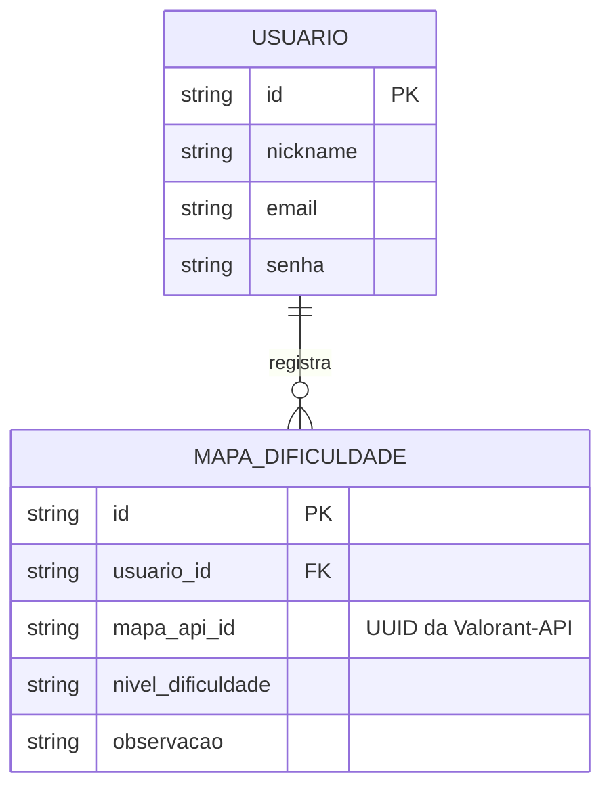

# ValoPlaybook — Modelo de Dados

## Diagrama Entidade-Relacionamento

O ValoPlaybook precisa armazenar os dados cadastrais dos jogadores e o registro personalizado de quais mapas eles possuem maior dificuldade, para fins de estudo.

Um usuário pode registrar diversos mapas em sua lista de dificuldades. Por isso, a relação entre `USUARIO` e `MAPA_DIFICULDADE` é direta, onde um usuário possui vários registros de mapas vinculados à sua conta. Os dados ricos dos mapas não ficam salvos no banco, sendo consumidos dinamicamente da API oficial.

## Entidades

### `USUARIO`

Representa a conta do jogador cadastrada no sistema.

* `id`: identificador único do usuário.
* `nickname`: nome de usuário ou Riot ID do jogador.
* `email`: endereço de e-mail para login.
* `senha`: senha de acesso à plataforma.

### `MAPA_DIFICULDADE`

Representa o mapeamento de um ponto fraco do jogador, relacionando a conta dele a um mapa específico do jogo.

* `id`: identificador único do registro.
* `usuario_id`: identifica o usuário dono do registro (Chave Estrangeira).
* `mapa_api_id`: identificador (UUID) do mapa correspondente na Valorant-API.
* `nivel_dificuldade`: o quão difícil o jogador considera o mapa (ex: Alta, Média, Baixa).
* `observacao`: anotações pessoais do jogador sobre o mapa (ex: "Tenho dificuldade em defender o bomb B").

*Nota: As informações ricas dos mapas (nome oficial, layout, imagens e radares) não são duplicadas nesta tabela, pois serão obtidas em tempo real utilizando o `mapa_api_id` por meio da consulta à Valorant-API pública.*
